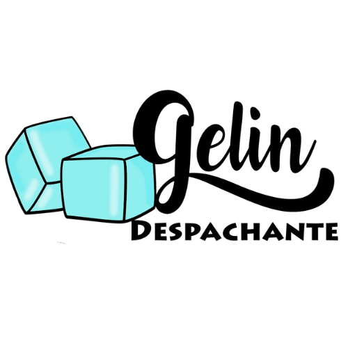

<div id="top"></div>


[![Stargazers][stars-shield]][stars-url]
[![Issues][issues-shield]][issues-url]
[![LinkedIn][linkedin-shield]][linkedin-url]


<!-- PROJECT LOGO -->
<br/>
<div align="center">
  <a href="https://github.com/acmachado14/despcar">
    
  </a>

  <h3 align="center">DespCar</h3>

  <p align="center">
    Um projeto de uso pessoal para um despachante veícular para consulta de carros através da placa 
  </p>
</div>


<!-- TABLE OF CONTENTS 
<details>
  <summary>Table of Contents</summary>
  <ol>
    <li>
      <a href="#about-the-project">About The Project</a>
      <ul>
        <li><a href="#built-with">Built With</a></li>
      </ul>
    </li>
    <li>
      <a href="#getting-started">Getting Started</a>
      <ul>
        <li><a href="#prerequisites">Prerequisites</a></li>
        <li><a href="#installation">Installation</a></li>
      </ul>
    </li>
    <li><a href="#usage">Usage</a></li>
    <li><a href="#roadmap">Roadmap</a></li>
    <li><a href="#contributing">Contributing</a></li>
    <li><a href="#license">License</a></li>
    <li><a href="#contact">Contact</a></li>
    <li><a href="#acknowledgments">Acknowledgments</a></li>
  </ol>
</details>
-->


<!-- ABOUT THE PROJECT -->
## Sobre o Projeto

<!--
[![Product Name Screen Shot][product-screenshot]](https://example.com)

There are many great README templates available on GitHub; however, I didn't find one that really suited my needs so I created this enhanced one. I want to create a README template so amazing that it'll be the last one you ever need -- I think this is it.

Here's why:
* Your time should be focused on creating something amazing. A project that solves a problem and helps others
* You shouldn't be doing the same tasks over and over like creating a README from scratch
* You should implement DRY principles to the rest of your life :smile:

Of course, no one template will serve all projects since your needs may be different. So I'll be adding more in the near future. You may also suggest changes by forking this repo and creating a pull request or opening an issue. Thanks to all the people have contributed to expanding this template!

Use the `BLANK_README.md` to get started.

<p align="right">(<a href="#top">back to top</a>)</p>
-->


### Construído Com

* [PHP](https://www.php.net/)
* [PHPUnit](https://phpunit.de/)
* [Laravel](https://laravel.com)
* [Bootstrap](https://getbootstrap.com)
* [MySQL](https://www.mysql.com/)
* [mPDF](https://mpdf.github.io/)


<!-- GETTING STARTED -->
## Primeiros Passos

Assumindo que você ja tem em sua máquina os componentes: PHP (>= 7.0), Laravel (>= 8.64) e Composer.
### Instalação

1. Get a free API Key at [http://www.placaapi.com/](http://www.placaapi.com/)
2. Clone o repositório
   ```sh
   git clone https://github.com/acmachado14/despcar.git
   ```
3. Instale os pacotes do Composer
   ```sh
   composer install
   ```
4. Entre com sua API no `HttpCarroController.php`
   ```js
   username = 'ENTER YOUR API';
   ```
5. Execute as migrations
   ```sh
   php artisan migrate
   ```
6. Suba o servidor local
   ```sh
   php artisan serve
   ```

<!-- USAGE EXAMPLES 
## Usage

Use this space to show useful examples of how a project can be used. Additional screenshots, code examples and demos work well in this space. You may also link to more resources.

_For more examples, please refer to the [Documentation](https://example.com)_

<p align="right">(<a href="#top">back to top</a>)</p>

-->

<!-- ROADMAP 
## Roadmap

- [x] Add Changelog
- [x] Add back to top links
- [ ] Add Additional Templates w/ Examples
- [ ] Add "components" document to easily copy & paste sections of the readme
- [ ] Multi-language Support
    - [ ] Chinese
    - [ ] Spanish

See the [open issues](https://github.com/othneildrew/Best-README-Template/issues) for a full list of proposed features (and known issues).

<p align="right">(<a href="#top">back to top</a>)</p>

-->

<!-- LICENSE -->
## Licença

Distribuido sob a GNUv3 License. Veja `LICENSE` para mais informações.


<!-- CONTACT -->
## Contato

Angelo - [@acmachado_14](https://twitter.com/acmachado_14) - cupertinoangelo13@gmail.com

Link do Projeto: [https://github.com/acmachado14/despcar](https://github.com/acmachado_14/despcar)


<!-- MARKDOWN LINKS & IMAGES -->
[contributors-shield]: https://img.shields.io/github/contributors/othneildrew/Best-README-Template.svg?style=for-the-badge
[contributors-url]: https://github.com/othneildrew/Best-README-Template/graphs/contributors
[forks-shield]: https://img.shields.io/github/forks/othneildrew/Best-README-Template.svg?style=for-the-badge
[forks-url]: https://github.com/othneildrew/Best-README-Template/network/members
[stars-shield]: https://img.shields.io/github/stars/acmachado14/despcar.svg?style=for-the-badge
[stars-url]: https://github.com/acmachado14/despcar/stargazers
[issues-shield]: https://img.shields.io/github/issues/acmachado14/despcar.svg?style=for-the-badge
[issues-url]: https://github.com/acmachado14/despcar/issues
[license-shield]: https://img.shields.io/github/license/othneildrew/Best-README-Template.svg?style=for-the-badge
[license-url]: https://github.com/acmachado14/despcar/blob/master/LICENSE.txt
[linkedin-shield]: https://img.shields.io/badge/-LinkedIn-black.svg?style=for-the-badge&logo=linkedin&colorB=555
[linkedin-url]: https://www.linkedin.com/in/%C3%A2ngelo-cupertino-9456b41b6/
[product-screenshot]: images/screenshot.png
